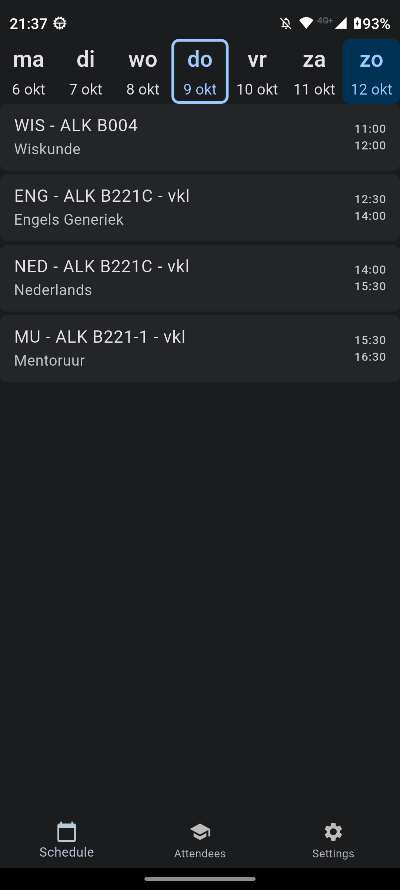
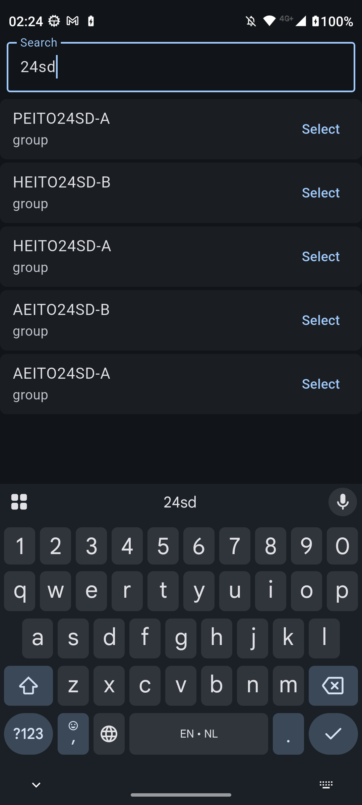

# xrooster

## Over xrooster
Betere rooster app voor myx omdat eduarte kut is.

## Installatie

### Optie 1: Download de laatste release
Download de nieuwste versie van de app via de [releases pagina](https://github.com/PhoebeSoftware/xrooster/releases).

### Optie 2: Zelf bouwen

```bash
git clone https://github.com/PhoebeSoftware/xrooster.git
cd xrooster
flutter pub get
flutter build apk
```

De APK bevindt zich dan in `./build/app/outputs/flutter-apk/app-release.apk`

### Optie 3: Debug mode

```bash
git clone https://github.com/PhoebeSoftware/xrooster.git
cd xrooster
flutter pub get
flutter run
```

# Screenshots
## Rooster

<p float="Schedule">
    
    
</p>

## Zoeken

<p float="Schedule">
    
    
</p>

## Instellingen

<p float="Instellingen">
    
</p>